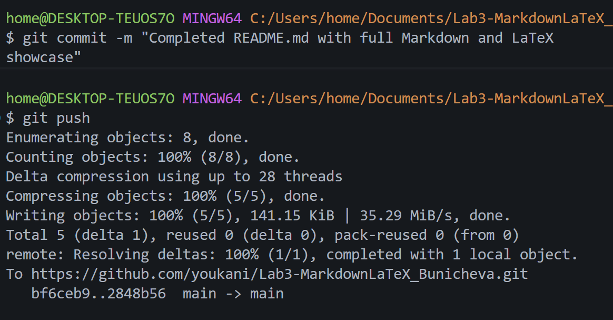

# Лабораторная работа №3.  Работа с Markdown-разметкой и базовое использование LaTeX в документации проекта.

Проект по изучению систем документирования кода. Цель: освоить базовые элементы Markdown-разметки, синтаксис таблиц, списков, вложенных конструкций, а также правила интеграции математических формул LaTeX.

## Содержание
1. [Структура проекта](#структура-проекта)
2. [Markdown-элементы](##Markdown-элементы)
3. [Заголовки](###Заголовки)
4. [Форматирование текста](###Форматирование-текста)
5. [Цитата](###Цитата)
6. [Блок кода](###Блок-кода)
7. [Таблица](###Таблица)
8. [Ссылки](###Ссылки)
9. [Чекбоксы](###Чекбоксы)
10. [Сноска](###Сноска)
11. [Alert-блоки GitHub](###Alert-блоки-GitHub)
12. [Inline LaTeX](###Inline-LaTeX)
13. [Block LaTeX](##Block-LaTeX)

---

## Структура проекта

* `Lab3_MarkdownLaTeX_FIO/` — корневая папка проекта
    * `docs/` — папка со всеми созданными Markdown-файлами
    * `img/` — папка для хранения отчетных скриншотов
    * `README.md` — главный файл документации репозитория

## Markdown-элементы
1. ### Заголовки
    1. # Заголовок H1
    2. ## Заголовок H2
    3. ## Заголовок H3

2. ### Форматирование текста
    - **полужирный шрифт**
    - *курсивное начертание*
    - ~~зачеркнутый текст~~
    - `моноширинный текст`

3. ### Цитата
> Документация — это зеркало качества программного обеспечения.

4. ### Блок кода

```csharp
string name;
name = Console.ReadLine();
Console.WriteLine(name)
```
5. ### Таблица

| Функция | Команда Git | Описание |
| :--- | :---: | ---: |
| Создание репозитория | `git init` | Инициализация репозитория |
| Просмотр состояния | `git status` | Показывает изменённые файлы |
| Отправка на GitHub | `git push` | Загружает коммиты на сервер |

6. ### Ссылки

[Ссылка на репозиторий](https://github.com/youkani/Lab3-MarkdownLaTeX_Bunicheva)

7. ### Чекбоксы
- [x] Практические задания
- [x] Оформление списков и таблиц
- [x] Изучение расширенных возможностей и LaTeX
- [x] Заполнение README.md

8. ### Сноска
Текст[^1]

9. ### Alert-блоки GitHub
>[!NOTE]
> Выравнивание улучшает читаемость таблиц.
> [!TIP]
> Markdown позволяет создавать профессионально оформленные репозитории на GitHub без использования тяжелых текстовых редакторов.
>[!WARNING]
> Не забудьте использовать git push!

10. ### Inline LaTeX
Площадь круга через радиус $S = \pi r^2$.

11. ## Block LaTeX
Сумма арифметической прогрессии:
$$
\sum_{i=1}^n i = \frac{n(n+1)}{2}
$$

---
[^1]: Сноска.
